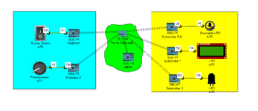

# COE 550 – IoT: Applications and Implementation  
## Homework Assignment #2 Report

**Course:** COE 550 – IoT: Applications and Implementation  
**Instructor:** Dr. Khaled Rabie  
**Date:** 03/29/2025  

---

## 1. Objective
The objective of this assignment was to implement a home automation system using the MQTT protocol in Cisco Packet Tracer. The system consists of IoT devices communicating through an MQTT Broker to demonstrate core MQTT-based IoT functionality.

---

## 2. System Overview
The system includes the following components:

- MQTT Broker hosted on a server  
- Wireless router for device connectivity  
- Rocker switch controlling a basic LED  
- Potentiometer controlling a dimmable LED  
- LCD display reflecting the state of LEDs  
- Individual SBCs (Single Board Computers) acting as MQTT clients for each IoT device  

---

## 3. Implementation Steps

1. Network was configured with a static IP for the MQTT Broker to ensure consistent client connectivity.  
2. Devices were connected through a home gateway (wireless router).  
3. SBCs were programmed using Python scripts to act as MQTT publishers and subscribers.  
4. Rocker switch published messages to turn the LED ON/OFF.  
5. Potentiometer published values to control the dimmable LED.  
6. LCD subscribed to topics and interpreted LED states as **LOW**, **MED**, or **HIGH**.  

---

## 4. Challenges Faced
Initially, the MQTT Broker had a dynamic IP address, requiring me to run `ipconfig` each time I launched Packet Tracer. This was resolved by assigning a static IP in the server configuration tab, ensuring stable communication between MQTT clients and the broker.

---

## 5. Conclusion
The system successfully demonstrated core MQTT functionality for a digital home simulation. Each component operated as expected, and the final configuration maintained stability and reliable communication after assigning a static IP to the broker.

---

## 6. Network Topology Screenshot

